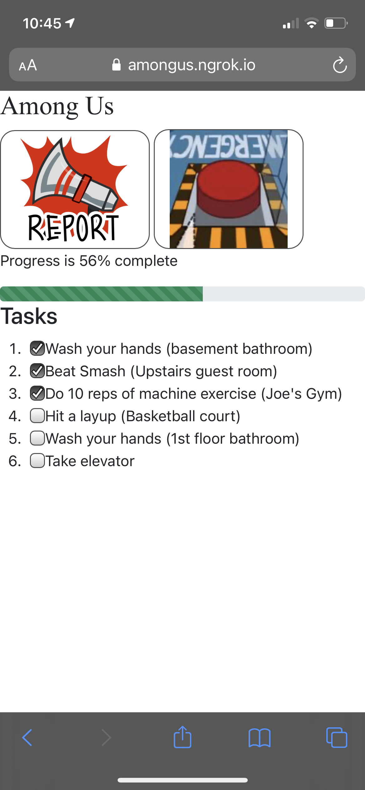

# Among Us in real life

I hacked together this small little web app for facilitating a game of Among Us in real life.

## Features

-   Assign impostors/crewmates
-   Assign tasks
-   Checking off tasks updates a global progress bar in real-time

Audio recordings from [https://www.voicy.network/pages/among-us](https://www.voicy.network/pages/among-us)

## Screenshot



## Usage

This was built for personal use, but anyone is welcome to use this for hosting their own game.

### 1. Configure the game

You may want to modify the following properties located in [`src/index.js`](https://github.com/michaelgira23/among-us-real-life/blob/master/src/index.js):

[`TASKS`](https://github.com/michaelgira23/among-us-real-life/blob/master/src/index.js#L14) - An array of strings that consist of all possible tasks. These will be randomly assigned to players.

[`N_TASKS`](https://github.com/michaelgira23/among-us-real-life/blob/master/src/index.js#L31) - Number of tasks to assign each player

[`N_IMPOSTORS`](https://github.com/michaelgira23/among-us-real-life/blob/master/src/index.js#L32) - Number of impostors to assign each round

### 2. Start the backend

Start the backend with

```
$ npm install
$ npm start
```

:information_source: Use a utility like [Nodemon](https://nodemon.io/) to automatically restart the backend upon any changes. This is useful when modifying the number of impostors or tasks.

### 3. Connect to the admin dashboard

Visit [http://localhost:4046/admin](http://localhost:4046/admin) to access the admin panel. There is a single button to start the game.

Pressing the start button will reset task progress, assign new tasks, and assign impostors. Press it once all players connect, otherwise you will have to press it again.

### 4. Invite friends to join

Players may access the the game at [http://localhost:4046](http://localhost:4046). On other computers (or phones), you will need to enter the computer's local IP or use a tunneling service like [ngrok](https://ngrok.com). Alternatively, you could deploy this yourself.

## Known issues

-   Sometimes, duplicate tasks are assigned (temporary workaround is to start another game)
-   On some Android phones, hiding the browser will reset its state, therefore losing your tasks
